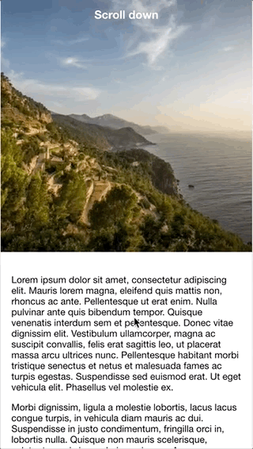

[](https://www.npmjs.com/package/ion-header-scroll-opacity/)
[](https://www.npmjs.com/package/ion-header-scroll-opacity)
[](https://www.npmjs.com/package/ion-header-scroll-opacity)

# ion-header-scroll-opacity

Now compatible with Ionic 4 🎉.

Change header background opacity on content scroll.

## install

```bash
npm i ion-header-scroll-opacity --save
```

If you are using Ionic 3 install `ion-header-scroll-opacity@^1.0.0` and use to the [ion-header-scroll-opacit#ionic-3 ](https://github.com/toriphes/ion-header-scroll-opacity/tree/ionic-3) branch for reference.

## Import directive

Import the `IonHeaderScrollOpacityModule` into the your page module

```typescript
import { IonHeaderScrollOpacityModule } from "ion-header-scroll-opacity";

@NgModule({
  [...]
  imports: [IonHeaderScrollOpacityModule],
  [...]
})
export class HomePageModule {}
```

## Usage

Put the `header-scroll-opacity` directive on the ion-header element.

### Directive Input

| Input         | Description                                                        | Default value |
| ------------- | ------------------------------------------------------------------ | ------------- |
| ionContentRef | `ion-content` reference                                            | _none_        |
| scrollAmount  | Amount of pixel to be scrolled in order end the opacity transition | 88            |
| isTransparent | If true the header background starts with opacity=0                | true          |

```html
<ion-header scrollOpacity [ionContentRef]="mycontent">
  <ion-toolbar color="primary">
    <ion-title>
      Do scroll
    </ion-title>
  </ion-toolbar>
</ion-header>

<ion-content #mycontent [scrollEvents]="true">
  ...long scrolling content...
</ion-content>
```

**Remember** to set `[scrollEvents]="true"` on the ion-content component otherwise the directive will not work.

### Tip

Add the `fullscreen` attribute to the `ion-content` element and add some css style to make a good effect

```css
.scroll-content {
  padding-top: 0px !important;
}
```

## Demo



## Contribute

Any pull-request and issues are wellcome
